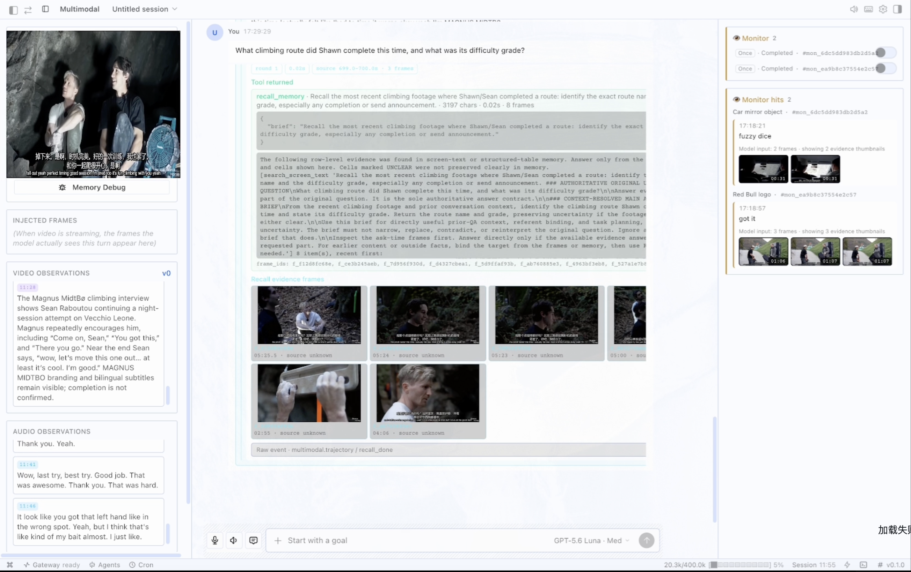
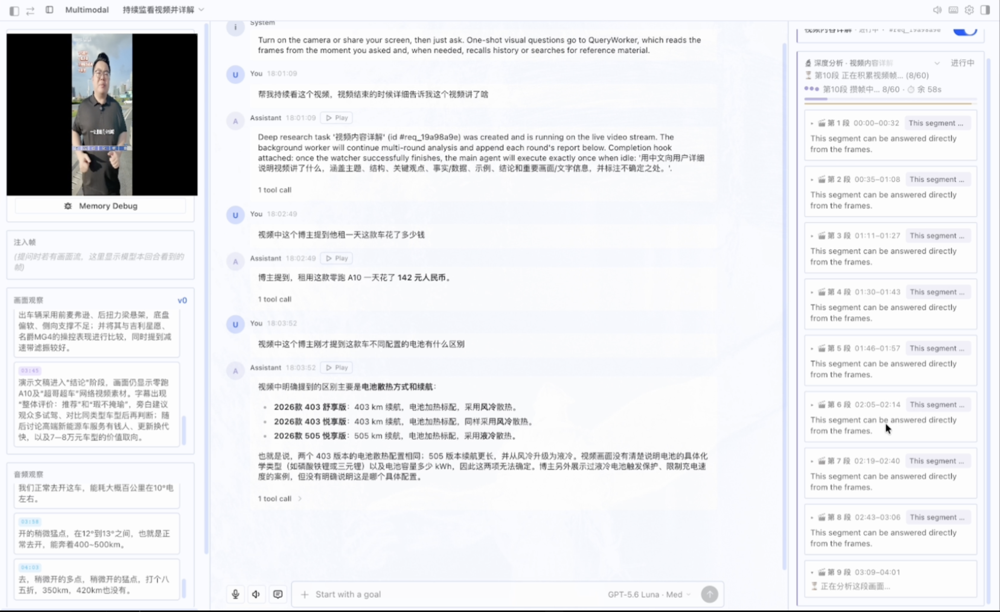

<p align="center">
  
</p>

# Argus

Argus is a multimodal AI assistant that can "watch and chat": the main Agent handles user text and semantic routing and **does not passively receive the live video feed**; one-shot visual questions and ongoing video tasks are delegated to dedicated workers. Two user-facing multimodal modes:

- **One-shot visual Q&A** — Present, historical, or mixed "on-screen entity + external facts" questions all go through `query_multimodal`. QueryWorker reads recent frames at question time, then answers directly, recalls historical memory, or searches external sources as needed.
- **Continuous monitoring / deep research** — Two background Agents: `set_monitor` (wait for an event → alert) and `set_live_watcher` (background segment-by-segment deep research, producing progress and a final report). Watcher has one mode only: start from the most recent segment, analyze round-by-round under TTL + frame-count dual gates until the stream stops or the user stops it (no qa/analysis/research taxonomy).

[简体中文](README.zh-CN.md) · [Español](README.es.md) · [اردو](README.ur-pk.md)

> Argus is derived from [Hermes Agent](https://github.com/NousResearch/hermes-agent)
> by Nous Research. The original copyright and MIT license are preserved in
> [LICENSE](LICENSE).

## Demo

Live "watch-and-chat" walkthroughs of Argus — screen share a video, ask a question, get a grounded answer from the multimodal Agent. **Click a thumbnail to watch on YouTube.**

<table>
<tr>
<td align="center" width="50%">
<a href="https://www.youtube.com/watch?v=suX31-o6lLM">
  <br/>
  <b>🇬🇧 English demo</b> (click to play)
</a>
</td>
<td align="center" width="50%">
<a href="https://www.youtube.com/watch?v=iCijSbVFRu8">
  <br/>
  <b>🇨🇳 中文 demo</b> (click to play)
</a>
</td>
</tr>
</table>

<sub>Hosted on YouTube. Full 4K originals are also available on the <a href="https://github.com/MMArgus-Team/Argus/releases/tag/v0.1.0-demos">v0.1.0-demos Release</a>.</sub>

## Highlights

- Current and historical visual question answering through `query_multimodal`.
- Continuous event monitoring with `set_monitor`.
- Long-running video research with `set_live_watcher`.
- Screen, camera, microphone, and shared-system-audio capture in the web and
  desktop clients.
- Layered multimodal memory for scenes, speech, events, and entities.
- The Hermes-compatible agent core, tools, skills, gateway, TUI, and desktop
  application.

## Requirements

- Python 3.11–3.13
- Node.js 20.19+ or 22.12+ for web and desktop builds
- `ffmpeg` for audio processing
- macOS screen and system-audio permissions for desktop screen sharing

## Install from PyPI

```bash
python -m pip install "mm-argus[web]"
argus setup
argus
```

The PyPI distribution is `mm-argus`; the primary command is `argus`. Legacy
`hermes`, `hermes-agent`, and `hermes-acp` entry points remain available for
compatibility with inherited integrations.

## Install from source

```bash
git clone https://github.com/MMArgus-Team/Argus.git
cd argus

uv venv --python 3.11 .venv
source .venv/bin/activate
uv pip install -e ".[web]"
```

On Windows PowerShell, run the native installer, then activate the environment:

```powershell
PowerShell -ExecutionPolicy Bypass -File scripts/install.ps1
.venv\Scripts\Activate.ps1
```

## Configuration

Secrets are never committed to the repository. Copy the public templates into
your local Argus home and fill in only the providers you use:

```bash
mkdir -p ~/.argus
cp config.example.yaml ~/.argus/config.yaml
cp .env.example ~/.argus/.env
```

- `~/.argus/config.yaml` contains behavior, model, endpoint, and multimodal
  settings.
- `~/.argus/.env` contains API keys, tokens, and passwords only.

Run the guided setup at any time:

```bash
argus setup
```

## Run

```bash
argus                         # Interactive CLI
argus dashboard               # Web dashboard
argus gateway                 # Messaging gateway
argus mm doctor               # Multimodal diagnostics
```

## Desktop development

```bash
npm install
npm --workspace apps/desktop run dev
```

The desktop app needs macOS Screen & System Audio Recording permission to
capture audio from a shared screen. After changing that permission, fully quit
and restart the desktop app before sharing again.

## Web development

```bash
npm install
npm --workspace web run dev
```

## Tests

Use the repository wrapper so credentials and local Argus state are isolated:

```bash
scripts/run_tests.sh
npm --workspace apps/desktop run test:desktop
```

## Documentation and support

- [Documentation source](website/docs)
- [Issues](https://github.com/MMArgus-Team/Argus/issues)
- [Security policy](SECURITY.md)
- [Contributing](CONTRIBUTING.md)

## License and attribution

Argus is distributed under the MIT License. It is a modified derivative of
Hermes Agent by Nous Research; upstream notices and copyright statements are
retained. See [LICENSE](LICENSE) for details.

Because of that lineage a few internal module names still read `hermes_*` —
most visibly the `hermes_cli` package, which holds the CLI implementation.
`argus_cli` is the canonical entry point (`argus` resolves to
`argus_cli.main:main`) and forwards into it, and the `hermes`, `hermes-agent`
and `hermes-acp` console scripts are kept as aliases so existing installs
keep working. The names are import-compatibility surface, not a sign that
you are running upstream Hermes.
